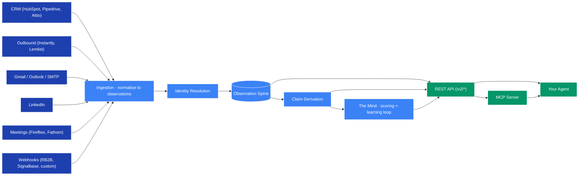

## Architecture

Nous is one stack: an evidence substrate, a claim-derivation engine, and a thin Context API. Connectors push observations in; agents read engineered context and write more observations. The substrate derives every fact.

The five pieces:

* [**Ingestion**](#ingestion) — every signal source becomes a stream of observations (events + state) with `source`, `method`, and `observed_at`. Nothing is overwritten.
* [**Identity Resolution**](#identity-resolution) — every observation is matched to a single entity using email, LinkedIn URL, domain, phone, and name+company fallback.
* [**Observation Spine**](#observation-spine) — the immutable, append-only record of everything that ever happened. The source of truth.
* [**Claim Derivation**](#claim-derivation) — claims (the facts you query) are computed from the observation spine. Every claim carries `freshness`, `confidence`, `epistemic_class`, and the `sources` that produced it.
* [**The Mind**](#the-mind) — predictions stake on claims, the substrate watches what closes, the Scorecard learns. The compounding loop that makes the system sharper every cycle.

The output surfaces — the REST API and the MCP server — are thin wrappers around the substrate. The substrate is the product.

---

### Ingestion

Connectors normalise every signal into an **observation** with a few fixed shapes:

- `kind: 'event'` — an interaction happened (`interaction.email_sent`, `interaction.call_held`, etc.)
- `kind: 'state'` — a fact was observed (`title`, `stage`, `intent`, etc.)

Sources include CRMs (HubSpot, Pipedrive, Attio), outbound platforms (Instantly, Lemlist), Gmail/Outlook/SMTP, LinkedIn (Unipile), meeting capture (Fireflies, Fathom), web identity (RB2B, Signalbase), and any HTTP source via HMAC-signed custom webhooks.

Agents themselves are signal sources too — any [`POST /v2/observations`](/public-api/observations) call adds to the same spine.

### Identity Resolution

Identity resolution is what makes Nous a substrate rather than another data store. Every inbound observation is resolved to a single entity using:

* Entity UUID (if you have one)
* Email address
* LinkedIn profile URL
* Domain (for companies)
* Phone number
* Name + company as a fallback (returns ambiguous when not unique)

The same person in Apollo, HubSpot, and Gmail becomes one entity — not three. Resolve a focus once at API boundary; the substrate handles the rest.

### Observation Spine

Every observation is **append-only**. Nothing is ever updated, nothing is ever deleted. A state observation with `value: null` asserts that a fact ended — the person left the company, the deal closed lost — without overwriting the history.

Two consequences:

1. **The substrate self-heals.** When a new observation contradicts an older one, the claim derivation re-runs and the belief shifts toward truth.
2. **Every claim is auditable.** Trace any claim back to the observations that produced it.

### Claim Derivation

You don't store facts — you derive them. The claim engine recomputes affected claims after every observation insert (via a `claim_jobs` trigger drained by a worker). Each claim carries:

| Field | Meaning |
|---|---|
| `freshness` | `fresh` / `aging` / `suspect` / `expired` — how recently observed |
| `confidence` | `0.0` – `1.0` — how strongly observations support it |
| `epistemic_class` | `observed` / `derived` / `asserted` — where the claim came from |
| `sources` | the connectors that contributed |

Your agent reads these epistemics on every claim — that's what lets it decide whether to act now or call [`/v2/verify`](/public-api/verify) first.

### The Mind

The loop that makes the system compound:

1. **Predict** — every entity with claims gets an `icp_fit` prediction staked on the current Scorecard
2. **Resolve** — outcomes (replies, pipeline advances, closed-won revenue) flow in as new observations
3. **Calibrate** — the Mind grades old predictions against the resolved outcomes
4. **Learn** — the Scorecard re-trains on calibrated outcomes; bad signals lose weight, good ones gain

You never see the loop as a feature — you see the result. The product is the [Context API](/public-api/introduction) and the [MCP tools](/mcp/introduction). The Mind is what makes them get sharper as you use them.
