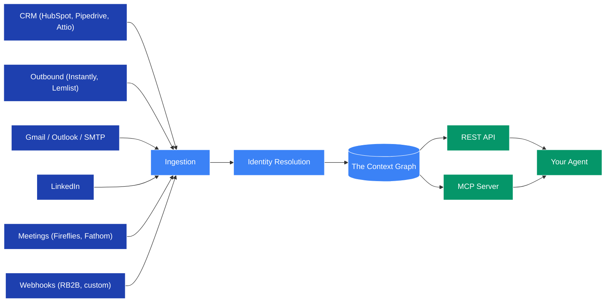

## Architecture

Nous is one stack. Connectors push signals from your GTM tools into Nous, identity resolution matches every signal to one person and one company, and the context graph holds the result. Your agent reads it back over MCP or REST.

The three pieces.

* [**Ingestion**](#ingestion). Every signal source becomes a stream of events and states with `source`, `method`, and `observed_at`. Nothing is overwritten.
* [**Identity Resolution**](#identity-resolution). Every signal is matched to one person and one company using email, LinkedIn URL, domain, phone, and a name plus company fallback.
* [**The Context Graph**](#the-context-graph). The append-only record of every person, conversation, and touchpoint at an account. Every fact carries freshness, confidence, and the sources that produced it.

The output surfaces, the REST API and the MCP server, are thin wrappers around the graph.

---

### Ingestion

Connectors normalise every signal into a fixed shape.

- `kind: 'event'`. An interaction happened (`interaction.email_sent`, `interaction.call_held`, and so on).
- `kind: 'state'`. A fact was observed (`title`, `stage`, `intent`, and so on).

Sources include CRMs (HubSpot, Pipedrive, Attio), outbound platforms (Instantly, Lemlist), Gmail, Outlook, SMTP, LinkedIn via Unipile, meeting capture (Fireflies, Fathom), web identity (RB2B), and any HTTP source via HMAC-signed custom webhooks.

Agents themselves are signal sources too. Any [`POST /v2/observations`](/public-api/observations) call adds to the same graph.

### Identity Resolution

Identity resolution is what makes Nous a graph rather than another data store. Every inbound signal is resolved to one person and one company using.

* Entity UUID (if you have one)
* Email address
* LinkedIn profile URL
* Domain (for companies)
* Phone number
* Name plus company as a fallback (returns ambiguous when not unique)

The same person in Apollo, HubSpot, and Gmail becomes one entity, not three. Resolve once at the API boundary and the graph handles the rest.

### The Context Graph

The graph is **append-only**. Nothing is ever updated, nothing is ever deleted. A state with `value: null` asserts that a fact ended (the person left the company, the deal closed lost) without overwriting history.

Two consequences.

1. **The graph self-heals.** When a new signal contradicts an older one, derived facts recompute and the belief shifts toward truth.
2. **Every fact is auditable.** Trace any fact back to the signals that produced it.

When your agent reads from the graph, every fact carries metadata.

| Field | Meaning |
|---|---|
| `freshness` | `fresh` / `aging` / `suspect` / `expired`. How recently observed. |
| `confidence` | `0.0` – `1.0`. How strongly the underlying signals support the fact. |
| `sources` | The connectors that contributed. |

Your agent reads these on every fact. That's what lets it decide whether to act now or call [`/v2/verify`](/public-api/verify) first.
